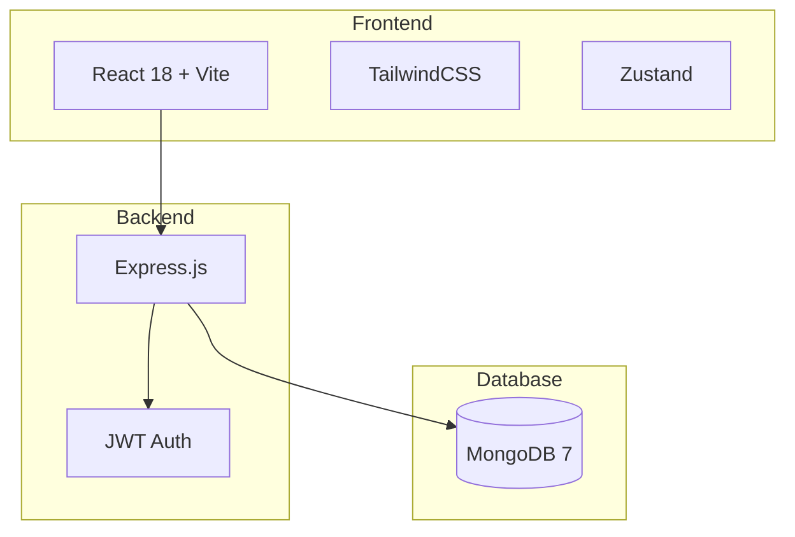

<div align="center">

# 🎮 RetroVault

[](https://nodejs.org)
[](https://reactjs.org)
[](https://mongodb.com)
[](https://docker.com)
[](LICENSE)

**Catálogo interativo de games retro com reviews, coleção pessoal e favoritos**

</div>

---

## 📖 Sobre

RetroVault é uma plataforma web completa para entusiastas de games retro. Navegue por um catálogo de jogos clássicos, escreva reviews, monte sua coleção pessoal e salve seus favoritos.

## 🏗️ Arquitetura



## 🛠️ Tech Stack

| Camada | Tecnologias |
|--------|------------|
| **Frontend** | React 18, Vite, TailwindCSS, Zustand, Axios, Heroicons |
| **Backend** | Node.js 20, Express, Mongoose, JWT, bcrypt |
| **Database** | MongoDB 7, Mongo Express (admin) |
| **DevOps** | Docker, Docker Compose, GitHub Actions |

## 📡 API Endpoints

| Método | Rota | Descrição | Auth |
|--------|------|-----------|------|
| POST | `/api/auth/register` | Criar conta | - |
| POST | `/api/auth/login` | Login | - |
| GET | `/api/auth/me` | Perfil do usuário | ✅ |
| PUT | `/api/auth/favorite/:gameId` | Toggle favorito | ✅ |
| PUT | `/api/auth/collection/:gameId` | Toggle coleção | ✅ |
| GET | `/api/games` | Listar games (filtros, paginação) | - |
| GET | `/api/games/platforms` | Listar plataformas | - |
| GET | `/api/games/:id` | Detalhes do game | - |
| POST | `/api/games` | Criar game | ✅ Admin |
| PUT | `/api/games/:id` | Editar game | ✅ Admin |
| DELETE | `/api/games/:id` | Deletar game | ✅ Admin |
| POST | `/api/games/:gameId/reviews` | Criar review | ✅ |
| GET | `/api/games/:gameId/reviews` | Listar reviews | - |
| DELETE | `/api/reviews/:id` | Deletar review | ✅ |

## 🚀 Rodando com Docker

```bash
docker compose up -d
```

- Frontend: http://localhost:3000
- Backend API: http://localhost:4000
- Mongo Express: http://localhost:8081

## 📄 Licença

[CC BY-NC 4.0](LICENSE) | Rone Bragaglia | Uso comercial proibido sem autorizacao
